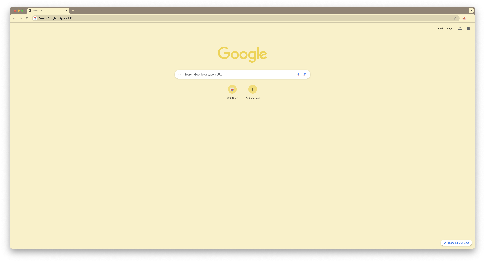

# Gruvbox Light Theme for Chrome & Edge

A Gruvbox Light theme for Chrome and Edge browsers – clean, warm, and easy on the eyes.  
Designed for users who prefer a light, comfortable browsing experience inspired by the Gruvbox color palette.

---

## 🌈 Features

- Warm, soft colors optimized for daytime browsing  
- Supports both Chrome and Edge  
- Lightweight and easy to install manually  
- Ideal for developers, writers, or anyone who prefers a soothing light theme  

---

## 📸 Screenshots

**Chrome**  
  

**Edge**  
   

---

## ⚡ Manual Installation (Developer Mode)

Since this theme is not published on the Chrome or Edge store, you can install it manually:

### 1. Download or Clone Repository
```bash
git clone https://github.com/yourusername/gruvbox-light-chrome.git
````

Or download the repository as a ZIP file and extract it.

---

### 2. Open Browser Extensions Page

* **Chrome:** `chrome://extensions/`
* **Edge:** `edge://extensions/`

---

### 3. Enable Developer Mode

* Toggle **Developer mode** ON (top-right corner of the page).

---

### 4. Load Unpacked Extension

1. Click **Load unpacked**
2. Select the folder containing the theme files (`manifest.json` and icons)
3. The theme should now be applied to your browser

---

### 5. Tips

* To switch back to the default theme, disable or remove the extension from the extensions page
* You can customize the theme further by editing the `manifest.json` color values
* Recommended for daytime/light environment browsing for better eye comfort

---

## 📝 License

This project is licensed under the **MIT License** – see the [LICENSE](LICENSE) file for details.

---

## 🤝 Contributing

* Pull requests are welcome!
* For major changes, please open an issue first to discuss what you would like to change
* Feel free to add new screenshots, tweak colors, or improve documentation
